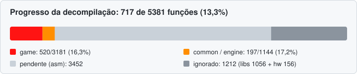

# War of the Monsters Recompiled!

Projeto de decompilação/recompilação de **War of the Monsters** (PS2, NTSC-U, SCUS-97197).

Você precisa de uma cópia própria do jogo. Nenhum arquivo do jogo vai para este repositório.

## Setup (WSL/Ubuntu)
```sh
sudo apt install binutils-mips-linux-gnu ninja-build python3-venv
python3 -m venv ~/.venvs/wotm && ~/.venvs/wotm/bin/pip install "splat64[mips]" pyelftools
```
1. Coloque a ISO em `ISO/` e extraia para `disc/` (por exemplo, `7z x -odisc ISO/*.iso`).
2. `~/.venvs/wotm/bin/python configure.py --split` gera a ROM, os símbolos, roda o splat e escreve o `build.ninja`.
3. `ninja` monta, linka e confere o SHA1 contra o executável original (`build/SCUS_971.97.rom: OK`).

`tools/symdiff.py` lista símbolos fora do lugar e `tools/romdiff.py` mostra as palavras que diferem quando o checksum falha.

Veja [docs/ANALYSIS.md](docs/ANALYSIS.md) para o que já se sabe sobre o executável.

<!-- PROGRESS:START -->
## Progresso da decompilação



| Área | Feitas | Total | % | Bytes |
|---|---:|---:|---:|---|
| `game` | 511 | 3181 | 16,1% | 48,4 KB de 909,0 KB (5,3%) |
| `common` / engine | 197 | 1144 | 17,2% | 27,5 KB de 252,4 KB (10,9%) |

"Feita" = função `matched` (byte a byte igual ao original) ou `equivalent` (C++ equivalente, ainda sem bater).
Ignoradas: **1212** funções, sendo 1056 de bibliotecas/SDK (`libs`: gcc, newlib, sce, lib989snd, crt0) e 156 de código de hardware do PS2 (`hw`) que o port substitui.
Gerado por `tools/update_readme.py` a partir de `config/status.csv` (veja `tools/progress.py`); total de 5381 funções.
<!-- PROGRESS:END -->
